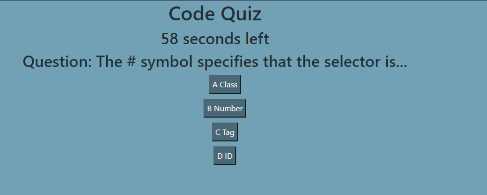
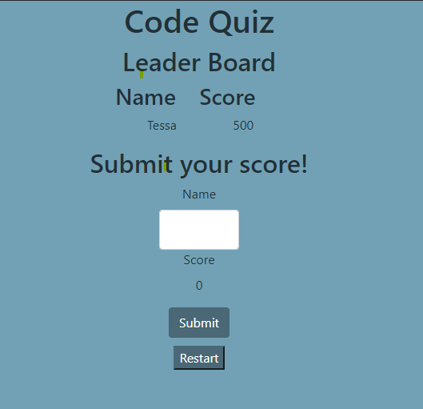

# homework04
## 04 Web APIs: Code Quiz

## User Story

```
AS A coding bootcamp student
I WANT to take a timed quiz on JavaScript fundamentals that stores high scores
SO THAT I can gauge my progress compared to my peers
```

## Acceptance Criteria

```
GIVEN I am taking a code quiz
WHEN I click the start button
THEN a timer starts and I am presented with a question
WHEN I answer a question
THEN I am presented with another question
WHEN I answer a question incorrectly
THEN time is subtracted from the clock
WHEN all questions are answered or the timer reaches 0
THEN the game is over
WHEN the game is over
THEN I can save my initials and score
```

### Review

GitHub URL: https://github.com/tesssapierce/homework04

GitPage URL: https://tesssapierce.github.io/homework04/


## How to use

```
Press the "Start Quiz" button to begin the quiz.
You will have 60 seconds to answer 4 questions, if the timer runs out, the quiz will end.
Each question has 4 choices and will display if you got the answer correct at the bottom of the page.
Each user can get a score of 0-4 and add their name to the leaderboard.
The leaderboard will contain any local storage that the user has from previous attemps.
You can restart the quiz by clicking the "restart" button at the end of the quiz, which will reload the page.
Good luck beating my high score of 500!
```

## Screenshots

The quiz will display one question at a time with its choices


The leaderboard will display high scores and allow the user to restart the quiz
